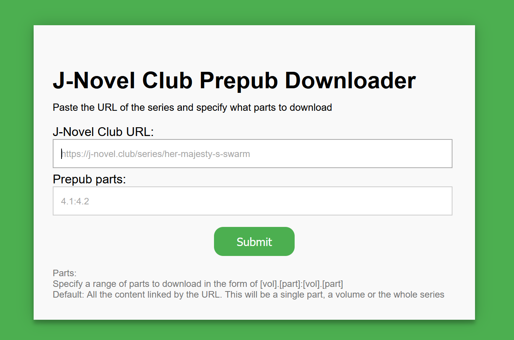

# JNCEP WebUI


---
[](https://github.com/NaruZosa/jncep_webui/blob/main/pyproject.toml)
[](https://img.shields.io/github/license/NaruZosa/jncep_webui)
---
## 📖 About The Project

**JNCEP WebUI** is a Flask-based web application designed to generate EPUB files for J-Novel Club pre-pub novels. It provides a user-friendly interface for the `jncep` tool, enabling seamless EPUB creation.

This app is perfect for readers who want to enjoy new pre-pubs on their e-reader immediately after release, even when a computer isn't accessible. If hosted on a server, it allows you to download pre-pubs directly to your phone and transfer them to an e-reader via a USB cable.

---

## ⚠️ Limitations & Disclaimer

- This tool supports J-Novel Club **novels only**—manga is not supported.
- **`jncep_webui` is unaffiliated with J-Novel Club and jncep.**  
  For issues related to this tool, please file a bug report on this project's repository, not with jncep.

---

## 🚀 Getting Started

To set up JNCEP WebUI, you have two installation options: **native installation** or **Docker**.

### Prerequisites

- A J-Novel Club account with an active membership.
- Configure the following environment variables:

| **Variable Name** | **Required** | **Description**                                                                  |
|-------------------|--------------|----------------------------------------------------------------------------------|
| `JNCEP_EMAIL`     | Yes          | Your J-Novel Club account login email.                                           |
| `JNCEP_PASSWORD`  | Yes          | Your J-Novel Club account login password.                                        |

---

### 🛠️ Installation

#### Native Installation (Coming soon)

1. Install Python 3 (tested with Python 3.13).
2. Install the package:
   ```bash
   pip install jncep_webui
   ```
3. Run the application:
   ```bash
   python jncep_webui
   ```

##### Manual installation
1. Install Python 3 (tested with Python 3.13).
2. Clone the repository:
   ```bash
   git clone https://github.com/NaruZosa/jncep_webui.git
   ```
3. Install the Python dependencies:
   ```bash
   pip install uv
   uv sync --locked
   ```
4. Run the application:
   ```bash
   uv run src\jncep_webui\app.py
   ```


#### Docker Installation

##### Docker Compose
1. Download the latest `compose.yml` file from this repository and (optionally) modify the `logs` path
2. Run `docker compose up` in the same path as the `compose.yml`

##### Docker Pull
1. Pull the Docker container from [GitHub Container Registry (GHCR)](https://ghcr.io/naruzosa/jncep_webui:latest).  
2. (Optional) Mount the `/logs` container path for logging:
   - Logs will automatically compress when they reach 50MB.
   - Logs older than one week will be deleted when new logs are created.
3. Start the container.

---

## 📚 Usage

### Web Application
JNCEP WebUI uses jncep to create the epub. If you want to know more about how the part specification works, check out the documentation for it [here](https://github.com/gvellut/jncep#range-of-parts).

**JNCEP WebUI** runs on port `5000`. Access the interface at `http://localhost:5000`.  



#### Input Fields:

| **Field**          | **Required** | **Description**                                                                                              |
|--------------------|--------------|--------------------------------------------------------------------------------------------------------------|
| `J-Novel Club URL` | Yes          | The URL for the J-Novel Club series, volume, or part.                                                        |
| `Prepub Parts`     | No           | Range of parts to download (e.g., `<vol>[.part]:<vol>[.part]`). Defaults to all parts for the specified URL. |

#### Steps to Generate EPUB:

1. Enter the **J-Novel Club URL**.
2. (Optional) Specify the **Prepub Parts**.
3. Click **Submit** to generate the EPUB.

If the parts span multiple volumes, each volume will be compiled into a separate EPUB, and all files will be bundled into a ZIP. The generated file will be served for download, typically within a few seconds.

---

### Web API

**JNCEP WebUI** can also function as a web API. Send a GET or POST request to `http://<host>:5000/epub` with the following headers:

| **Header**       | **Required** | **Description**                                      |
|------------------|--------------|------------------------------------------------------|
| `jnovelclub_url` | Yes          | Maps to the `J-Novel Club URL` field.                |
| `prepub_parts`   | No           | Maps to the `Prepub Parts` field.                    |
| `JNCEP_EMAIL`    | No           | Overrides the `JNCEP_EMAIL` environment variable.    |
| `JNCEP_PASSWORD` | No           | Overrides the `JNCEP_PASSWORD` environment variable. |

#### Example API Requests:

- With parts specified:
  ```
  http://localhost:5000/epub?jnovelclub_url=<series_url>&prepub_parts=4.1
  ```
- To download all parts:
  ```
  http://localhost:5000/epub?jnovelclub_url=<series_url>
  ```

The response will include the generated EPUB or ZIP file.

---

## 🛤️ Roadmap

- [ ] Add to PyPi
- [ ] Add an Unraid Community Applications template.
- [ ] Create an installable application using [PyInstaller](https://github.com/pyinstaller/pyinstaller) and [Inno Setup](https://github.com/jrsoftware/issrc).
- [ ] Send a notification when a new prepub part is available, with a direct download link

For more details, check out the [open issues](https://github.com/NaruZosa/jncep_webui/issues).

---

## 🤝 Contributing

Contributions are always welcome! Here’s how you can help:

1. Fork the repository.
2. Create a new branch (`git checkout -b feature/AmazingFeature`).
3. Commit your changes (`git commit -m 'Add some AmazingFeature'`).
4. Push to your branch (`git push origin feature/AmazingFeature`).
5. Open a pull request.

Remember to star the repository if you find it helpful! 😊

---

## 📜 License

This project is distributed under the **GNU General Public License (GPL) v3**. See `LICENSE.txt` for details.

---

## 📝 Acknowledgments

- **[gvellut](https://github.com/gvellut/jncep)** for creating `jncep`, which does all the heavy lifting, thank you!
- **[Delgan](https://github.com/Delgan/loguru)** for `Loguru`, it makes logging dead-simple.
- **[othneildrew](https://github.com/othneildrew/Best-README-Template)** for the readme template.
- **[J-Novel Club](https://j-novel.club/)** for their translations and public API.

---

## 📬 Contact

Project Repository: [JNCEP WebUI](https://github.com/NaruZosa/jncep_webui)